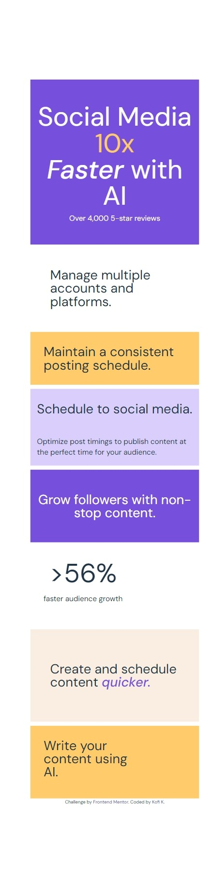

# 3 column preview Card Component

## Project Links

## Introduction

This is a project to design to build out a bento Grid whcih changes layout and each object's position depending on the screen size and get it looking as close to the design as possible.
The objectives of this project was to:

- Make the users have a `optimal view` of the webpage depending on their devices.
- Make users see the `focus and hover states` of some important elements.

## Screenshots

Desktop and Mobile Views

<!--
Active States

 -->

## Built with

- HTML
- CSS
- React

## What I learnt

- I actually revised on how to develop webpages with grid layout.I learnt more new syntaxes inlcuding CSS transform which I used for the images being half hidden and also how the grid layouts which ngl,was useful for changing the positions of the grid's components depending on the device or screen size.
  I might have to learn how to do this but with flexbox instead but that can be later.

# Contacts

